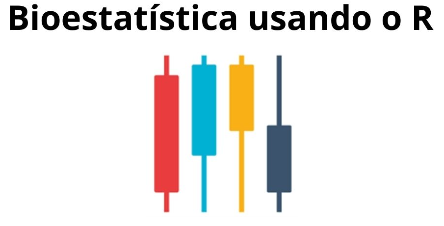

--- 
title: | 
  {width=500px style="display: block; margin:0 auto;"}  
    
author: "Petrônio Fagundes de Oliveira Filho"
date: "`r Sys.Date()`"
site: bookdown::bookdown_site
documentclass: book
bibliography: [book.bib]
csl: vancouver.csl
---

# Introdução

## Importância da Bioestatística 

Os indivíduos variam em relação as suas características biológicas, psicológicas e sociais na saúde e na doença. Esta variabilidade gera uma grande quantidade de incertezas.

A Bioestatística, estatística aplicada às ciências biológicas e da saúde, é a ferramenta utilizada pelos pesquisadores para trabalhar com essas incertezas advindas da variabilidade. Várias definições foram escritas para a estatística, uma delas é a seguinte [@armitage2008statistical]:

> <font size=3> Estatística é a disciplina interessada com o tratamento dos dados numéricos obtidos a partir de grupos de indivíduos </font>

A Bioestatística lida com a variabilidade humana utilizando técnicas estatísticas quantitativas @massad2004metodos que ajudam a diminuir a ignorância em relação a esta diversidade. A compreensão da variabilidade humana torna a medicina mais ciência, diminuindo as incertezas, na tentativa de verificar se os resultados encontrados de fato existem ou são apenas obra do acaso.  

Na década de 1990, houve um acesso maior aos computadores. Os profissionais da saúde não estatísticos passaram a ter mais interesse no campo da bioestatística. Isto gerou uma onda que facilitou o aparecimento de novas ferramentas estatísticas de ponta. Apesar disso, o conhecimento da Bioestatística permanece restrito aos especialistas na área.

Nos últimos anos, os pacotes de softwares foram aprimorados, tornando-se mais amigáveis e diminuindo significativamente o pânico ao se defrontar com uma série de números uma vez que a maioria deles exige apenas conhecimento básico de matemática.

Para a tomada de decisão em saúde é fundamental o acúmulo de conhecimento adquirido através da prática clínica, geradora da experiência do profissional, do intercâmbio com os pares e da análise adequada das evidências científicas publicadas em periódicos de qualidade. Para atingir este objetivo, é fundamental o conhecimento de bioestatística, incluindo aqui que o pensamento que deve nortear os profissionais da saúde ao lidar com o ser humano é o *pensamento probabilístico*.  

## Pílulas históricas da Estatística {#sec-historia}

> <font size=3> A história deve começar em algum lugar, mas a história não tem começo @kendall1960studies </font>

Entretanto, é natural, que se trace as raízes voltando ao passado, tanto quanto possível. Alguns referem-se à curiosidade em relação ao registro de dados à dinastia Shank, na China, possivelmente no século XIII a.c, com a realização de censos populacionais. Há relatos bíblicos de possíveis censos realizados por Moisés (1491 a.C.) e por Davi (1017 a.C.).

Os romanos e os gregos já realizavam censos por volta do século VIII a IV a.C. Em 578-534 a.C., o imperador *Servo Túlio* mandou realizar um censo de população masculina adulta e suas propriedades que serviu para estabelecer o recrutamento para o exército, para o exercício dos direitos políticos e para o pagamento de impostos. Os romanos fizeram 72 censos entre 555 a.C. e 72 d.C. A punição para quem não respondia, geralmente era a morte! Na Idade Média, na Europa, existem registros de diversos censos: durante o domínio muçulmano, na Península Ibérica, nos séculos VII a XV; no reinado de Carlos Magno (712-814) e ainda o maior registro estatístico feito na época, o *Domesday Book* (Figura \@ref(fig:domesday)), realizado na Inglaterra, por Guilherme I @kendall1960studies , o Conquistador, onde registravam nascimentos, mortes, batismos e casamentos. Houve, também, recenseamentos nas repúblicas italianas no século XII ao XIII [@ine2014censos].

```{r domesday, echo = FALSE, out.width = '40%', fig.align = 'center', fig.cap="Domesday Book", fig.pos="h"}
 knitr::include_graphics("https://imgur.com/NYbAP67.png")
```

*John Graunt* (24/04/1620 - 18/04/1674) foi um cientista britânico a quem se deve vários estudos demográficos ingleses. Foi o precursor da construção de Tábuas de Mortalidade. Realizou estudos com William Petty (1623 - 1687), economista britânico que propôs a *aritmética política*. 

Em 1791, *Sir John Sinclair* (1754 - 1835) concebeu um plano de uma pesquisa empírica na Escócia para fornecer informações estatísticas. Foi a primeira vez que o termo estatística foi usado em inglês.

*Girolamo Cardano* (24/09/1501 - 21/09/1576) foi um médico, matemático, físico e filósofo italiano. É tido como o primeiro a introduzir ideias gerais da teoria das equações algébricas e as primeiras regras da probabilidade, descritas no livro *Liber de Ludo Aleae*, publicado em 1663. Descreveu pela primeira vez a clínica da febre tifoide. Foi amigo de Leonardo da Vinci.

*Pierre-Simon Laplace*, Marquês Laplace (23/03/1749 - 05/03/1927) foi um matemático, astrônomo e físico francês. Embora conduzisse pesquisas substanciais sobre física, outro tema principal dos esforços de sua vida foi a teoria das probabilidades. Em seu *Essai philosophique sur les probabilités*, Laplace projetou um sistema matemático de raciocínio indutivo baseado em probabilidades, que hoje coincidem com as ideias bayesianas.

*Antoine Gombaud*, conhecido como Chevalier de Méré (1607 - 1684) foi um nobre e jogador. Como não tinha mais sucesso nos jogos de azar, buscou ajuda de Blaise Pascal (19/06/1623 -- 19/08/1662), matemático, físico francês, que se correspondeu com Pierre Fermat (matemático e cientista francês), nascendo desta colaboração a teoria matemática das probabilidades (1812). Blaise Pascal foi mais tarde chamado de o Pai da Teoria das Probabilidades.

A moderna teoria das probabilidades foi atribuída a *Abraham De Moivre* (25/05/1667 -- 27/11/1754), matemático francês, que adquiriu fama por seus estudos na trigonometria, teoria das probabilidades e pela equação da curva normal. Em 1742, Thomas Bayes (1701 -- 07/04/1761, matemático e pastor presbiteriano, inglês, desenvolveu o Teorema de Bayes que descreve a probabilidade de um evento ocorrer, baseado em um conhecimento *a priori*.

*Adrien-Marie Legendre* (18/09/1752 - 10/01/1833) foi um matemático francês. Em 1783, tornou-se membro adjunto da *Academie des Sciences*, instituição que esteve na vanguarda dos desenvolvimentos científicos dos séculos XVII e XVIII. Fez importantes contribuições à estatística, à teoria dos números e à álgebra abstrata.

*Johann Carl Friedrich Gauss* (30/04/1777 - 23/02/1855) foi um matemático, astrônomo e físico alemão (Figura \@ref(fig:gauss)) que contribuiu em diversas áreas das ciências como teoria dos números, estatística, geometria diferencial, eletrostática, astronomia e ótica. Muitos referem-se a ele como o Príncipe da Matemática, o mais notável dos matemáticos. Descobriu o método dos mínimos quadrados e a lei de Gauss da distribuição normal de erros e sua curva em formato de sino, hoje tão familiar para todos que trabalham com estatística.

```{r gauss, echo = FALSE, out.width = '30%', fig.align = 'center', fig.cap="Johann Carl Friedrich Gauss", fig.pos="h"}
 knitr::include_graphics("https://imgur.com/Pk9Il89.png")
```

*Lambert Adolphe Jacques Quételet* (22/02/1796 - 17/02/1874) foi um astrônomo, matemático, demógrafo e estatístico francês. Seu trabalho se concentrou em estatística social, criando regras de determinação de propensão ao crime

*Francis Galton* (16/02/1822 -- 17/01/1911) foi um antropólogo, matemático e estatístico inglês. Entre muitos artigos e livros, criou o conceito estatístico de correlação e da regressão à média. Ele foi o primeiro a aplicar métodos estatísticos para o estudo das diferenças e herança humanas de inteligência. Criou o conceito de eugenia e afirmava que era possível a melhoria da espécie por seleção artificial. Acreditava que a raça humana poderia ser melhorada caso fossem evitados relacionamentos indesejáveis. Isto acompanhava o pensamento burguês europeu da época. Criou a psicometria, onde desenvolveu testes de inteligência para selecionar homens e mulheres brilhantes. Esta teoria teve papel importante na formação do fascismo e nazismo [@salgado2011sir].

*William Farr* (30/11/1807 - 14/04/1883) foi um médico sanitarista e estatístico inglês, nascido na vila de Kenley, Shropshire. Foi o primeiro investigador a examinar séries temporais de morbimortalidade para longos períodos e, assim, considerado o criador da Estatística da Saúde Pública Moderna. Seus relatórios foram fundamentais para o desencadeamento das reformas sanitárias britânicas, em meados e final do século XIX [@stolley1995beginnings].

*Florence Nightingale* (12/05/1820 -- 13/08/1910) foi uma enfermeira (Figura \@ref(fig:florence)) que ficou famosa por ser pioneira no tratamento de feridos, durante a Guerra da Criméia [@history2009]. Ficou conhecida na história pelo apelido de "A dama da lâmpada", pelo fato de servir-se de uma lamparina para auxiliar no cuidado aos feridos durante a noite. Também contribuiu no campo da Estatística, sendo pioneira na utilização de métodos de representação visual de informações, como por exemplo gráfico de setores (habitualmente conhecido como gráfico do tipo "pizza")

```{r florence, echo = FALSE, out.width = '20%', fig.align = 'center', fig.cap="Florence Nightingale", fig.pos="h"}
 knitr::include_graphics("https://i.imgur.com/nHsLBsU.png")
```

*John Snow* (York, 15/03/1813 - Londres, 15/03/1858) foi um médico inglês (Figura \@ref(fig:snow)), considerado pai da Epidemiologia Moderna. Recebeu, em 1853, o título de Sir após ter anestesiado a rainha Vitória no parto sem dor de seu oitavo filho, Leopoldo de Albany. Este fato ajudou a divulgar a técnica entre os médicos da época. Demonstrou que a cólera era causada pelo consumo de águas contaminadas com matérias fecais, ao comprovar que os casos dessa doença se agrupavam em determinados locais da cidade de Londres, em 1854, onde havia fontes dessas águas [@stolley1995beginnings].

```{r snow, echo = FALSE, out.width = '20%', fig.align = 'center', fig.cap="John Snow", fig.pos="h"}
 knitr::include_graphics("https://i.imgur.com/jh61uxb.png")
```

*Karl Pearson* (27/03/1857 - 27/04/1936) foi um importante estatístico inglês, fundador do Departamento de Estatística Aplicada da *University College London* em 1911. Juntamente com Weldon e Galton fundou, em 1901, a revista *Biometrika* com o objetivo era desenvolver as teorias estatísticas, editada até os dias de hoje. O trabalho de Pearson como estatístico fundamentou muitos métodos estatísticos de uso comum, nos dias atuais: regressão linear e o coeficiente de correlação, teste do qui-quadrado de Pearson, classificação das distribuições [@moore_2000].

*Charles Edward Spearman* (10/09/1863 - 17/09/1945) foi um psicólogo inglês conhecido pelo seu trabalho na área da estatística, como um pioneiro da análise fatorial e pelo coeficiente de correlação de postos de Spearman. Ele também fez bons trabalhos de modelos da inteligência humana.

*William Sealy Gosset* (13/07/1876 - 16/10/1937) foi um químico e estatístico inglês (Figura \@ref(fig:student)). Em 1907, enquanto trabalhava químico da cervejaria experimental de Arthur Guinness & Son, criou a distribuição t que usou para identificar a melhor variedade de cevada, trabalhando com pequenas amostras. A cervejaria Guinness tinha uma política que proibia que seus empregados publicassem suas descobertas em seu próprio nome. Ele, então, usou o pseudônimo "Student" e o teste é chamado "t de Student" em sua homenagem @salsburg2009.

```{r student, echo = FALSE, out.width = '20%', fig.align = 'center', fig.cap="William Sealy Gosset", fig.pos="h"}
 knitr::include_graphics("https://i.imgur.com/Zyul6nM.png")
```

*Ronald Aylmer Fisher* (17/02/1890 - 29/07/1962) foi um estatístico, biólogo e geneticista inglês. Em 1919, Fisher se envolveu com pesquisa agrícola no centro de experimentos de *Rothamsted Research*, em Harpenden, Inglaterra, e desenvolveu novas metodologias e teoria no ramo de experimentos [@hald2007]. Durante sua vida, Fisher (Figura \@ref(fig:fisher)) escreveu 7 livros e publicou cerca de 400 artigos acadêmicos em estatística e genética . Em um dos seus livros, *The design of Experiments* (1935), Fisher relata um experimento que surgiu de uma pergunta curiosa: o gosto do chá muda de acordo com a ordem em que as ervas e o leite são colocados? Essa simples questão resultou em um estudo pioneiro na área e serviu de sustentação para análise da aleatorização de dados experimentais [@salsburg2009]. Ronald A. Fisher foi descrito @kruskal1980 como "um gênio que criou praticamente sozinho os fundamentos para o moderno pensamento estatístico". Era muito temperamental. Seus atritos com outros estatísticos ficaram famosos, entre eles encontra-se ninguém menos do que Karl Pearson, outro notável estatístico.

```{r fisher, echo = FALSE, out.width = '20%', fig.align = 'center', fig.cap="Ronald A. Fisher", fig.pos="h"}
 knitr::include_graphics("https://i.imgur.com/6EVp4eC.png")
```

*Austin Bradford Hill* (08/07/1897 - 18 /04/1991) foi um epidemiologista e estatístico inglês (Figura \@ref(fig:hill)), pioneiro no estudo do acaso nos ensaios clínicos e, juntamente com Richard Doll, foi o primeiro a demonstrar a ligação entre o uso do cigarro e o câncer de pulmão. Hill é amplamente conhecido pelos Critérios de Hill, conjunto de critérios para a determinação de uma associação causal [@stolley1995lung].

```{r hill, echo = FALSE, out.width = '20%', fig.align = 'center', fig.cap="Bradford Hill", fig.pos="h"}
 knitr::include_graphics("https://i.imgur.com/MbHvZ7c.png")
```

*John Wilder Tukey* (16/06/1915 - 26/07/2000) foi um estatístico norte-americano. Desenvolveu uma filosofia para a análise de dados que mudou a maneira de pensar dos estatísticos, sugerindo que se faça uma visualização dos dados, interpretando o formato, centro, dispersão, presença de valores atípicos, sumarizar numericamente e por fim escolher um modelo matemático. Foi o criador do boxplot e introduziu a palavra "bit" como uma contração do termo *binary digit*.

*Douglas G. Altman* (12 /07/1948 - 03/06/2018) foi um estatístico inglês (Figura \@ref(fig:altman)), conhecido por seu trabalho em melhorar a confiabilidade dos artigos de pesquisa médica @matthews2018douglas e por artigos altamente citados sobre metodologia estatística. Ele foi professor de estatística em medicina na Universidade de Oxford. Há praticamente 30 anos, Altman @altman1994scandal escreveu um artigo sobre problema da qualidade da pesquisa em medicina que causou um grande impacto e permanece válido até hoje. Nesta publicação ele afirma:

> <font size=3> A má qualidade de muitas pesquisas médicas é amplamente reconhecida, mas, de forma perturbadora, os líderes da profissão médica parecem apenas minimamente preocupados com o problema e não fazem nenhum esforço aparente para encontrar uma solução.</font>

```{r altman, echo = FALSE, out.width = '20%', fig.align = 'center', fig.cap="Douglas G. Altman", fig.pos="h"}
 knitr::include_graphics("https://i.imgur.com/X4wigwm.png")
```
  
## História resumida do R

O R é uma linguagem e um ambiente de desenvolvimento voltado fundamentalmente para a computação estatística. Foi inspirado em duas linguagens: S (John Chambers, do Bell Labs) que forneceu a sintaxe e Scheme (Hal Abelson e Gerald Sussman) implementou e forneceu a semântica.\
O nome R provém em parte das iniciais dos criadores, *George Ross Ihaka* e *Robert Gentleman* (Figura \@ref(fig:ross)), e também de um jogo figurado com a linguagem S. Em 29 de Fevereiro de 2000, o software foi considerado com funcionalidades e estável o suficiente para a versão 1.0.

O R é um projeto GNU [^1]. Software Livre significa que os usuários têm liberdade para executar, copiar, distribuir, estudar, alterar e melhorar o software. Foi desenvolvido em um esforço colaborativo de pessoas em vários locais do mundo @rproject2022.

[^1]: Esta sigla está associada ao animal gnu africano, símbolo de software de distribuição livre, quer dizer is Not Unix, sigla recursiva muito comum entre nerds!

O projeto R fornece uma grande variedade de técnicas estatísticas e gráficas. É uma linguagem e um ambiente similar ao S. A linguagem do S que também é uma linguagem de computador voltada para cálculos estatísticos. Um dos pontos fortes de R é a facilidade com que produções gráficas de qualidade podem ser produzidas. O R é também altamente expansível com o uso dos pacotes, que são bibliotecas para sub-rotinas específicas ou áreas de estudo específicas. Um conjunto de pacotes é incluído com a instalação de R e muito outros estão disponíveis na rede de distribuição do R - *Comprehensive R Archive Network* (CRAN) @cranmirrors2022.

```{r ross, echo = FALSE, out.width = '40%', fig.align = 'center', fig.cap="Robert Gentlemen (E) e George Ross (D)", fig.pos="h"}
 knitr::include_graphics("https://i.imgur.com/gjp0Rkc.png1")
```

A linguagem R é largamente usada entre estatísticos e analistas de dados para desenvolver softwares de estatística e análise de dados. Pesquisas e levantamentos com profissionais da área da saúde mostram que a popularidade do R aumentou substancialmente nos últimos anos @Whitney2020.

## Sobre o autor  

**Petrônio Fagundes de Oliveira Filho** nasceu em 04/10/1947, em Porto Alegre, Rio Grande do Sul, Brasil. Estudou no Ensino Médio do Colégio do Rosário, em Porto Alegre. Possui graduação em Medicina pela Universidade de Caxias do Sul (UCS), em 1973, residência em Pediatria no Hospital da Criança Conceição, Porto Alegre (1975) e mestrado em Saúde Pública Materno Infantil, Universidade de São Paulo (1998). Em 1980, obteve o Título de Especialista em Pediatria (TEP) e, em 2009, o título de especialista em Estatística Aplicada (UCS). Atuou como Pediatra no INAMPS até 2002 e em consultório privado até hoje. Aposentou-se como professor da Universidade de Caxias do Sul (UCS), em 2019, onde atuou desde 1975, nas áreas de Pediatria, Epidemiologia e Bioestatística, foi coordenador do Serviço e da Residência Médica em Pediatria, chefe de Departamento, coordenador do curso de Medicina e diretor de Ensino do Hospital Geral de Caxias do Sul (Hospital de Ensino da Universidade de Caxias do Sul) e membro de Conselho de Ética em Pesquisa da Universidade de Caxias do Sul, ligado ao CONEP (Conselho Nacional de pesquisa). Durante mais de 20 anos fez parte do Núcleo de Consultoria e Epidemiologia do Centro de Ciência da Saúde (UCS).
É autor de dois livros: Epidemiologia e Bioestatística: Fundamentos para a leitura crítica (Editora Rubio, 2015 e 2018) e SPSS - Análise de Dados Biomédicos, em coautoria com Valter Motta (MedBook, 2009). Além disso, participou de dezenas publicações e de capítulos de outros livros.
Desde 1976, é casado com Lena Maria Cantergiani Fagundes de Oliveira. Tem duas filhas, Nathalia e Andressa, e dois lindos netos, Gabriel e Felix. Ah, tem um cão shitzu branco, marrom claro e com algumas manchas pretas, Floquinho, que ao acompanhar seus estudos e análises estatísticas, late toda vez que ele menciona o nome de Ronald Fisher.  

email: petronioliveira@gmail.com  
WhatsApp: (54)999715499
